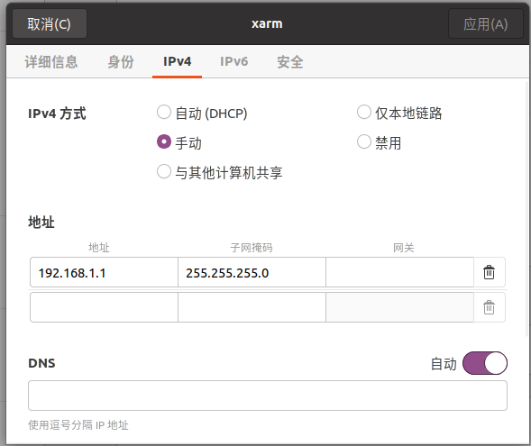
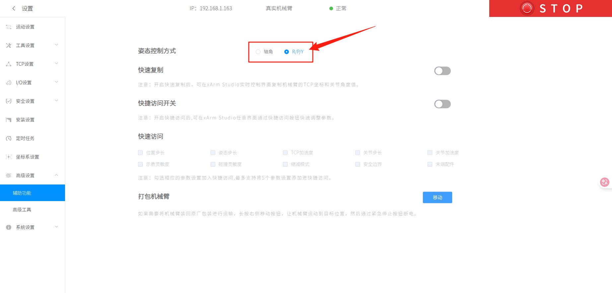

<div align="center">
  <h1 align="center"> PikaAnyArm </h1>
  <h3 align="center"> Agilex Robotics </h3>
  <p align="center">
    <a href="README.md"> English </a> | <a>中文</a> 
  </p>
</div>

## 0. 介绍

该仓库实现了使用 pika sense 对 Piper 以及 Xarm lite6 机械臂进行遥操作。

## 1. 准备

1、克隆代码下本地并将其放置到 pika_ros/src 下

```bash
cd ~/pika_ros/src

git clone https://github.com/agilexrobotics/PikaAnyArm.git
```

2、编译代码

```bash
cd ~/pika_ros

catkin_make install -DCATKIN_WHITELIST_PACKAGES=""
```

3、安装环境依赖

```bash
conda create -n pika python=3.8.18

conda activate pika

conda install pinocchio casadi -c conda-forge

pip install meshcat rospkg pyyaml
```

我们仅在 Ubuntu 20.04 上测试了我们的代码，其他操作系统可能需要不同的配置。

在运行程序时如遇到：

```bash
ImportError: /lib/x86_64-linux-gnu/libstdc++.so.6: version `GLIBCXX_3.4.29' not found (required by /home/agilex/miniconda3/envs/pika/lib/python3.8/site-packages/pinocchio/pinocchio_pywrap_default.cpython-38-x86_64-linux-gnu.so)
```

则在终端输入：

```bash
export LD_PRELOAD=/home/agilex/miniconda3/envs/pika/lib/libstdc++.so.6 
```

再次执行代码即可。

## 2. 开始

### 2.1 单臂遥操Piper

1、机械臂使能

将机械臂的can线接入电脑

然后执行：

```bash
cd ~/pika_ros/src/piper_ros

bash can_activate.sh can0 1000000
```

2、对pika进行校准，详细步骤可参考 Pika 产品用户手册的 【2.1 基站部署】和【2.5 定位基站校准】

3、开启遥操单Piper程序

```bash
source ~/pika_ros/install/setup.bash

roslaunch remote_operation teleop_single_piper.launch
```

### 2.2 双臂遥操Piper

1、机械臂使能

先将左机械臂的can线接入电脑

然后执行：

```bash
cd ~/pika_ros/src/piper_ros

bash find_all_can_port.sh 
```

终端会出现左机械臂的端口号，接着将右机械臂的can线接入电脑

再次执行：

```bash
bash find_all_can_port.sh 
```

终端会出现左机械臂的端口号。

将这左右两个端口号复制到 can_config.sh 文件的 111 和 112 行，如下所示：

```bash
# 预定义的 USB 端口、目标接口名称及其比特率（在多个 CAN 模块时使用）
if [ "$EXPECTED_CAN_COUNT" -ne 1 ]; then
    declare -A USB_PORTS 
    USB_PORTS["1-8.1:1.0"]="left_piper:1000000"  #左机械臂
    USB_PORTS["1-8.2:1.0"]="right_piper:1000000" #右机械臂
fi
```

保存完毕后，激活左右机械臂使能脚本：

```bash
cd ~/pika_ros/src/piper_ros

bash can_config.sh 
```

2、对pika进行校准，详细步骤可参考 <<Pika 产品用户手册>> 的 【2.1 基站部署】和【2.5 定位基站校准】

3、开启遥操单Piper程序

```bash
source ~/pika_ros/install/setup.bash

roslaunch remote_operation teleop_double_piper.launch
```


### 2.3 遥操单臂Xarm lite6

配置xarm机械臂:

1、将机械臂网口接入电脑后，对网口进行配置：

我们使用的是 lite6 这款机械臂，它默认的 IP 为：192.168.1.163

不同的机械臂可能配置会有所不同，下面是lite6的网口配置



配置好后，打开 xarm 的 web 端：

http://192.168.1.163:18333/?lang=cn&channel=prod

2、在设置里面找到高级设置里面的辅助功能，确保姿态控制方式为 R/P/Y 方式。



3、开启遥操单 Xarm 程序

```bash
roslaunch remote_operation teleop_single_xarm.launch
```

## 3. 配置文件说明

在 config 文件夹中：

1、piper_params.yaml 中的：

- gripper_xyzrpy 指的是夹爪相对于机器人joint6的偏移量，单位是米和弧度。
- target_joint_state 指的是机械臂初始位姿的6个关节角度，单位为弧度。

2、xarm_params.yaml 中的：

- eff_position 指的是机械臂的执行器初始位置和方向，单位是毫米和弧度。
- pika_to_arm 指的是从pika夹爪中心坐标系到机械臂末端执行器坐标系的转换，单位是米和弧度。


## 4. 遥操你的机械臂

为了方便用户使用 pika sense 遥操自己的机械臂，我们在此说明：

- pika 夹爪末端坐标系
- pika_pose 话题信息

### 4.1 pika坐标系图


pika的坐标系是在夹爪中心上，通过 pika_pose 话题发布。

pika_pose 话题的坐标系如上图所示：x轴朝前、y轴朝左、z轴朝右。

### 4.2 话题信息

单个 pika sense 遥操下发控制机械臂的话题名为：/pika_pose，左右手 pika sense遥操下发话题分别对应：/pika_pose_l、/pika_pose_r。

/pika_pose 话题的数据类型为 geometry_msgs::PoseStamped，市场主流机械臂一般都会开放机械臂末端控制接口，其消息类型也是 geometry_msgs::PoseStamped

代码可以参考：teleop_xarm.py


